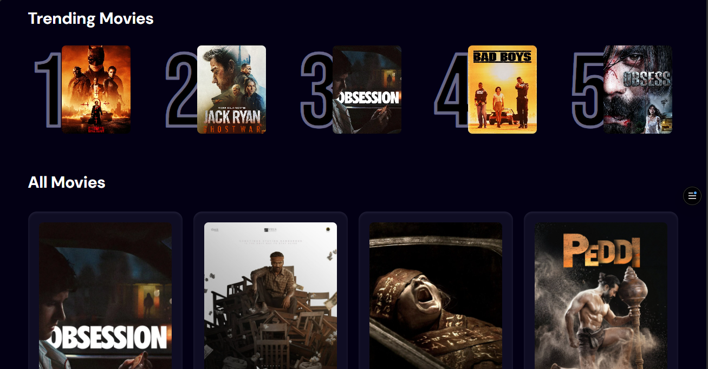

# 🎬 Movie App

Badges Line:
[Vite](https://vitejs.dev/) | [React](https://react.dev/) | [Tailwind CSS](https://tailwindcss.com/) | [Appwrite](https://appwrite.io/) | [Vercel](https://vercel.com/)

A modern, responsive movie discovery web application that allows users to search for movies, view popular releases, and discover trending films using The Movie Database (TMDB) API.

---

## ✨ Live Demo

🔴 Live Application: https://movie-app-blue-kappa.vercel.app/

---

## 📸 Screenshots

## 📸 Screenshots

| Homepage | Search Results |
|----------|----------------|
|  |  |


---

## ✨ Features

✅ Search movies by title
✅ View popular movies
✅ Trending movies section
✅ Loading state with spinner
✅ Error handling with user messages
✅ Fully responsive design
✅ Debounced search (reduces API calls)
✅ Appwrite analytics integration
🔜 Movie details page (Coming soon)

---

## 🛠️ Tech Stack

- React 19 - Frontend framework
- Vite - Build tool and dev server
- Tailwind CSS - Styling and responsive design
- TMDB API - Movie data source
- Appwrite - Backend for trending movies analytics
- Vercel - Hosting and deployment

---

## 📁 Project Structure

```
movie-app/
├── public/
│   └── hero.png
├── src/
│   ├── components/
│   │   ├── Search.jsx
│   │   ├── MovieCard.jsx
│   │   └── Spinner.jsx
│   ├── appwrite.js
│   ├── App.jsx
│   ├── main.jsx
│   └── index.css
├── .env
├── .npmrc
├── vercel.json
├── index.html
├── package.json
├── README.md
└── screenshots/
    ├── homepage.png
    └── search.png
```

---

## 🏃‍♂️ Run Locally

Prerequisites:
- Node.js (v18 or higher)
- npm or yarn
- TMDB API key
- Appwrite project (optional)

Installation Steps:

1. Clone the repository
   git clone https://github.com/Bereket-Ketema/Movie-app.git
   cd Movie-app

2. Install dependencies
   npm install

3. Create environment variables
   
   Create a .env file in the root directory:
   
   VITE_TMDB=your_tmdb_bearer_token_here
   VITE_APPWRITE_ENDPOINT=your_appwrite_endpoint
   VITE_APPWRITE_PROJECT_ID=your_project_id

4. Start development server
   npm run dev

5. Build for production
   npm run build

---

## 📚 What I Learned

API Integration - Fetching data from external APIs, handling responses, and managing API keys securely

React Hooks - useState, useEffect, and creating custom hooks like useDebounce

Debouncing - Limiting API calls to improve performance and respect rate limits

Component Architecture - Breaking UI into reusable, maintainable components

Error Handling - Graceful error handling with user-friendly messages

Environment Variables - Securing sensitive data in .env files

Deployment - Deploying to Vercel and configuring environment variables

Backend Integration - Using Appwrite for data persistence

---

## 🐛 Challenges Faced & Solutions

Challenge: API key exposure
Solution: Used environment variables with VITE_ prefix

Challenge: Too many API calls on every keystroke
Solution: Implemented custom useDebounce hook (1 second delay)

Challenge: react-use package incompatible with React 19
Solution: Created custom debounce hook instead of external dependency

Challenge: 401 Unauthorized error
Solution: Fixed API key variable naming

Challenge: Build failing on Vercel
Solution: Added .npmrc with legacy-peer-deps=true

Challenge: 404 on page refresh
Solution: Added vercel.json with rewrite rules

---

## 📈 Future Improvements

- Movie Details Page - Click on any movie to see detailed information
- Pagination - Load more movies instead of infinite scroll
- User Authentication - Sign up/login with Appwrite
- Watchlist - Save favorite movies to watch later
- Movie Trailers - Embed YouTube trailers for each movie
- Advanced Filters - Filter by genre, year, rating
- Dark/Light Mode - Theme toggle
- Performance Optimization - Implement React.memo and lazy loading
- Unit Tests - Add testing with Vitest or Jest

---

## 🎯 Goal

The ultimate goal is to make this app fully competitive with Netflix - a complete movie streaming experience with user accounts, watchlists, recommendations, and more.

---

## 🙏 Acknowledgments

- TMDB for providing the movie database API
- Appwrite for backend services
- Vercel for hosting
- React community for excellent documentation

---

## 📝 License

This project is open source and available under the MIT License.

---

## 👨‍💻 Developed By

Bereket Ketema

GitHub: https://github.com/Bereket-Ketema

---

⭐ If you found this project helpful, please give it a star on GitHub!
